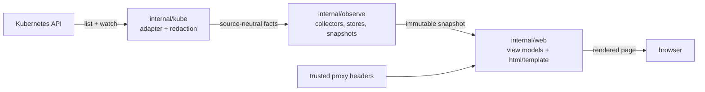

# Architecture

pgConsole is a single stateless process with a strict internal shape: the
Kubernetes API is touched in exactly one package, rendering happens from
immutable snapshots, and mutation exists only where it is enumerated.

## The pipeline

- **`internal/kube`** is the only package that imports client-go. It lists
  and watches, converts each object to source-neutral facts, and
  categorizes every error at the boundary so no request URL or token
  escapes.
- **`internal/observe`** runs one bounded, stale-retaining collector per
  resource kind and publishes immutable snapshots.
- **`internal/web`** renders snapshots through `html/template`, applies the
  security headers, and gates routes on the proxy-asserted level.

## Layers of authority

Three layers, and the lowest one caps everything:

1. **The proxy** authenticates the user and asserts a coarse level.
2. **The console** maps that level onto route admission — it decides what a
   user *sees*, never what can physically happen.
3. **The ServiceAccount Role** decides what can physically happen, in every
   mode. A bug in layer 2 cannot exceed layer 3.

See [Authorization](authorization.md) for the level model.

## Preserving uncertainty

Every layer is built to keep uncertainty intact from the API server to the
page. A broken watch, a forbidden response, or missing data becomes
`unknown` or **stale** — never a healthy, current cluster. The snapshot is
the normal rendering path, so API latency never determines page latency;
the only request-time API calls are the closed exception list (log tail,
readiness, operations, and the access-review decision write).

A collector that loses its watch re-fetches a fresh snapshot and resumes
from that point; there is no periodic resync timer and no resync knob to
tune. Watch health surfaces as staleness on the affected section, not as a
setting an operator has to reason about.

## The mutation surface

In read-only mode the assembly graph contains **no writer** — it is
provably absent, not merely disabled. Mutation-shaped calls are confined by
a static scan to `internal/ops` (the day-2 operations) and the narrow
`internal/kube/ops.go` transport, which also carries the single
access-review status write. Everything else is reads.

## The process lifecycle

pgConsole is one stateless process. It reads its entire configuration once,
at startup, from environment variables interpreted in a single place
(`internal/config`); every other package receives typed, validated values,
never the raw environment. Kubernetes configuration comes only from the
in-cluster ServiceAccount — no kubeconfig file is read. On `SIGTERM` (or
`SIGINT`) the process stops accepting new requests, drains the in-flight
ones within a bounded window, and cancels the watch collectors so no
goroutine outlives shutdown.

## Security properties

- No Secret access, ever — the Role grants nothing on `secrets`.
- No SQL and no object-storage access — those are sibling components' jobs.
- All rendering goes through `html/template`; no `template.HTML` from
  external data; messages are length-bounded.
- UI assets are compiled into the binary (`embed.FS`) and served locally;
  nothing is fetched at runtime. No embedded iframes, external scripts,
  fonts, styles, or telemetry — monitoring depth is a single link-out to an
  operator-configured URL.
- Sensitive routes send `Cache-Control: no-store`, a strict CSP,
  `X-Content-Type-Options: nosniff`, and a referrer policy.
- State-changing routes exist only as POST with CSRF and same-origin
  checks, and only when their capability is enabled.
